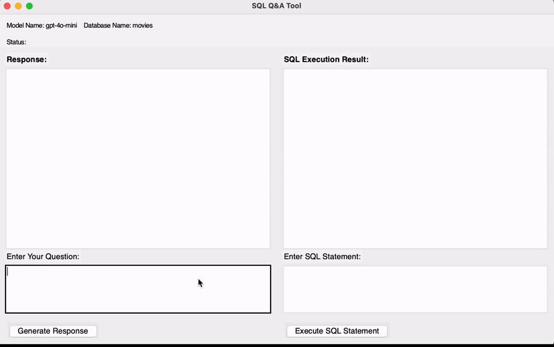
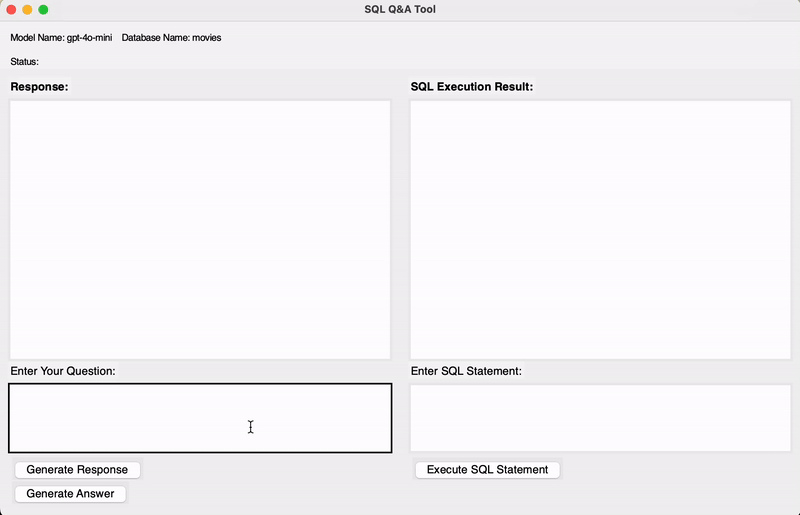

# QA_SQL
An LLM-driven SQL questions-answering tool for PostgreSQL database. 

## Set Up

### Install

Install the necessary dependencies for connecting with the PostgreSQL database and using the OpenAI Large Language Model:

```bash
pip install openai psycopg2-binary
```

Then, replace your OpenAI API key in the `QA_sql\LLM.py` file.

### Run

Run the following Python script to open the interactive UI application:

```bash
python QA_sql/run.py --model_name MODEL_NAME --database_name DATABASE_NAME
```

Replace `MODEL_NAME` with your choice of LLM model and `DATABASE_NAME` with your database name. 

The application supports both locally hosted models and OpenAI models.

## Demos



Generate answer for user's question.

